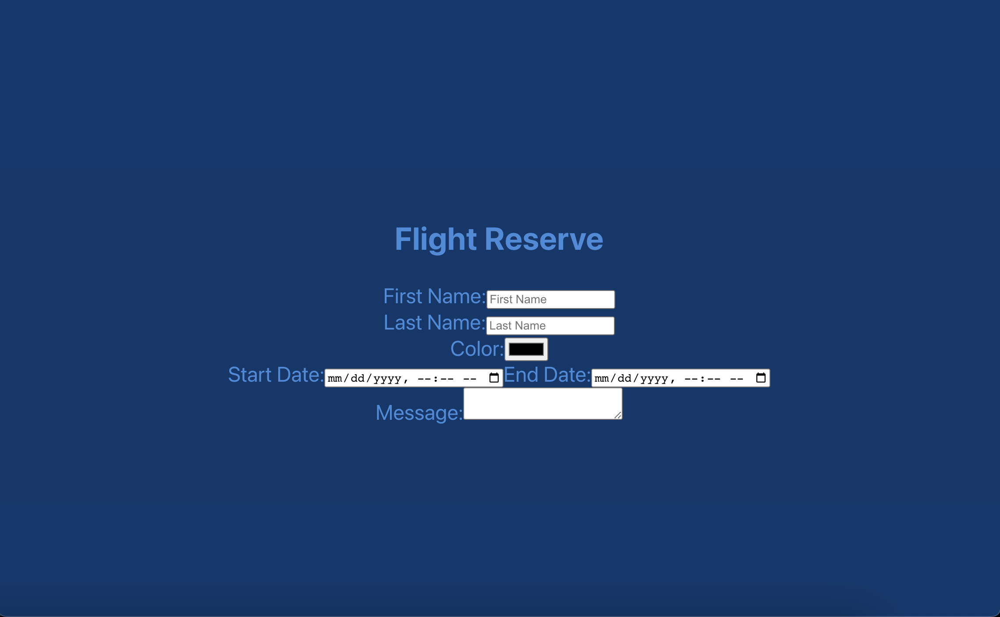

# Form Practice - React.js App
Building a React app with onChange
functionality for an HTML form in Class C-10 for BocaCode practice on the first day of week 5.



## Covered In Class
* onChange
* Form Elements
* Controlled Components

## Basic code
```
	<label> Name:
	<input type=“text”/>
	</label>
```